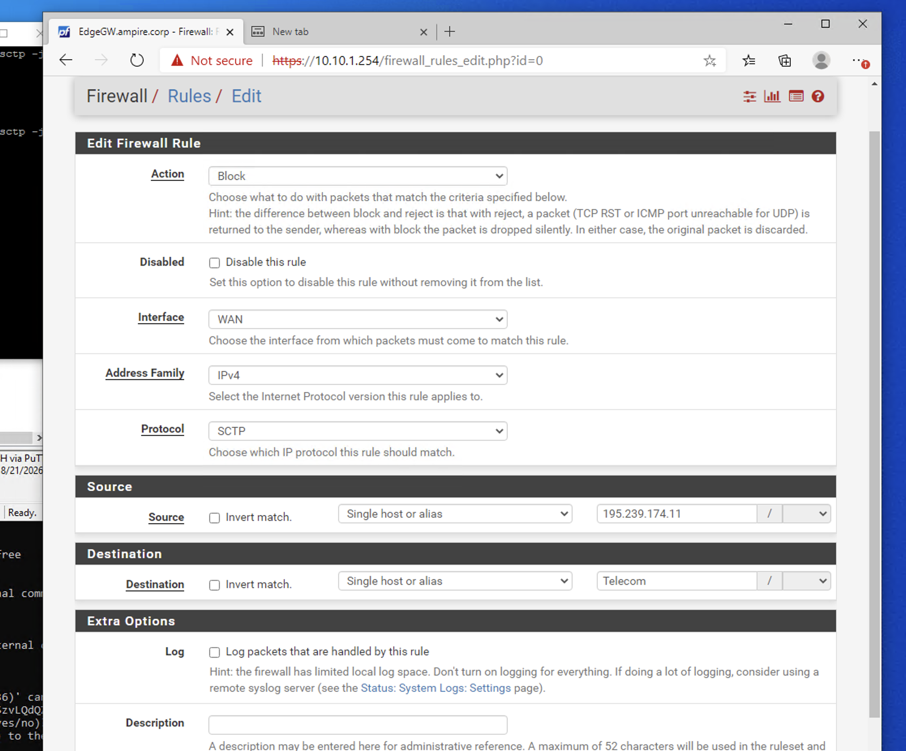
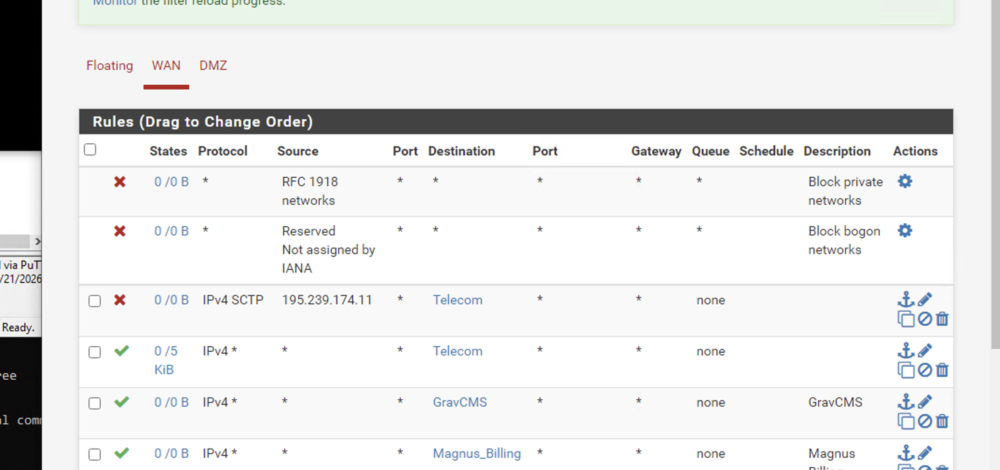
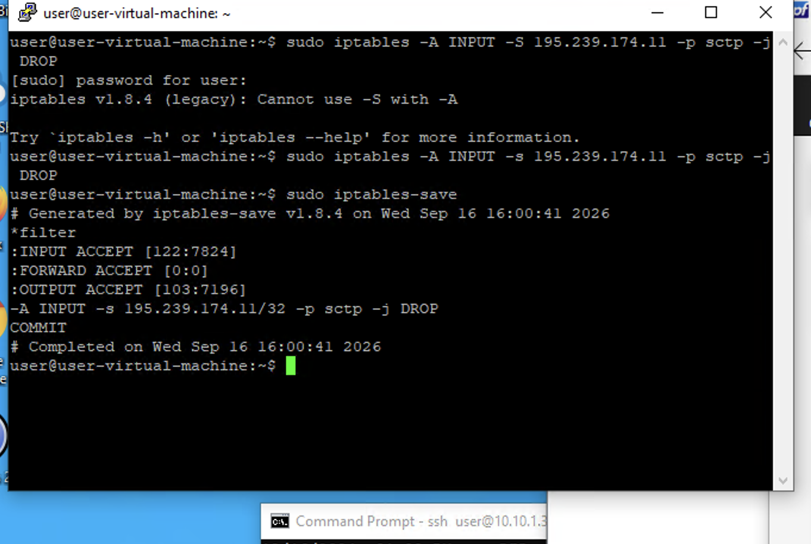

# Лабораторная работа №3

## Расследование инцидента с утечкой конфиденциальной информации о сотрудниках

### Цель работы

Изучить сценарий расследования инцидента с утечкой конфиденциальной информации в телекоммуникационной сети, ознакомиться с уязвимостью SendIMSI в протоколе SS7, научиться выявлять признаки эксплуатации по журналам операционной системы и сетевому трафику, а также выполнить блокирование подозрительного трафика с использованием pfSense и `iptables`.

### Оборудование и программное обеспечение

В работе используется учебный программный комплекс Ampire. Согласно сценарию, инфраструктура состоит из двух виртуальных машин:

- Kali Linux — машина внешнего нарушителя, с которой осуществляется атака;
- Dragon OS — машина, эмулирующая работу протокола SS7 со стороны сервера и жертвы.

Для симуляции сервера используется фреймворк SigPloit. Для анализа сетевого трафика применяется Wireshark. Для блокирования трафика используются межсетевой экран pfSense и утилита `iptables`.

---

## 1. Общая характеристика сценария

Рассматриваемый сценарий называется «Расследование инцидента с утечкой конфиденциальной информации о сотрудниках».

Уровень сложности сценария — 2 из 10. В качестве нарушителя рассматривается внешний злоумышленник, обладающий инструментами для проведения компьютерных атак.

Основная последовательность действий нарушителя:

1. выполняется сканирование сети `195.239.174.0/24`;
2. обнаруживается открытый порт 2901 на одной из машин;
3. эксплуатируется уязвимость SendIMSI в протоколе SS7;
4. посредством сигнальных сообщений запрашивается конфиденциальная информация об абоненте;
5. в результате нарушитель получает IMSI.

Уязвимость SendIMSI связана с возможностью отправки через протокол SS7 запросов на получение IMSI. IMSI (International Mobile Subscriber Identity) является уникальным идентификатором абонента в мобильной сети.

---

## 2. Подготовка лабораторной среды

### Действие 1. Запуск виртуальных машин

Необходимо запустить подготовленные виртуальные машины учебного стенда Ampire. В соответствии со сценарием должны быть доступны:

- Kali Linux — узел внешнего нарушителя;
- Dragon OS — узел, эмулирующий сервер и жертву SS7.

После запуска необходимо убедиться, что обе виртуальные машины работают и доступны в рамках учебной инфраструктуры.

### Действие 2. Проверка структуры лабораторного стенда

Необходимо ознакомиться с логической схемой сценария и определить назначение каждой виртуальной машины. Kali Linux используется со стороны нарушителя, а Dragon OS — для эмуляции серверной части и жертвы протокола SS7.


---

## 3. Анализ сценария атаки

### Действие 3. Определение исходной сети

В сценарии указано, что нарушитель выполняет сканирование сети `195.239.174.0/24`. В рамках анализа необходимо зафиксировать указанную сеть и обратить внимание на наличие доступных узлов и сервисов.

Сканирование в данном отчёте рассматривается как начальный этап сценария, после которого нарушитель обнаруживает открытый порт 2901.


### Действие 4. Фиксация открытого порта

После обнаружения доступного узла необходимо зафиксировать, что в сценарии используется открытый порт 2901. Этот порт становится одной из исходных точек дальнейшего анализа инцидента.


### Действие 5. Определение типа эксплуатации

Следующим этапом является эксплуатация уязвимости SendIMSI в протоколе SS7. Согласно сценарию, злоумышленник использует сигнальные сообщения для отправки запроса, связанного с получением IMSI абонента.

Важным признаком инцидента является наличие запросов SendIMSI в журналах и сетевом трафике.


---

## 4. Обнаружение эксплуатации средствами операционной системы

### Действие 6. Переход к журналу событий

Для обнаружения эксплуатации уязвимости необходимо использовать Dragon OS.

Сначала следует открыть терминал или файловый менеджер операционной системы и перейти к файлу журнала:

`/home/gh0/restcomm-jss7-7.0.1383/ss7/maplog.log`

Данный журнал содержит события, связанные с запросами SendIMSI.


*Рисунок 6 — Расположение журнала событий `maplog.log`.*

### Действие 7. Анализ содержимого `maplog.log`

Необходимо открыть файл `maplog.log` и просмотреть зарегистрированные события.

При анализе необходимо обратить внимание на записи, связанные с SendIMSI. Наличие таких запросов позволяет определить факт эксплуатации соответствующей уязвимости.

Следует зафиксировать в отчёте найденную запись или несколько записей, которые подтверждают наличие запросов SendIMSI.


### Действие 8. Переход в каталог `/var/log`

Следующим этапом необходимо открыть каталог:

`/var/log`

В данном каталоге находится файл с дампом трафика, собранного во время атаки.

Необходимо найти соответствующий файл дампа и определить его название.


### Действие 9. Открытие дампа в Wireshark

После обнаружения файла дампа необходимо открыть его с помощью Wireshark на машине реагирования.

Wireshark используется для детального анализа сетевого обмена и поиска сообщений, связанных с эксплуатацией SendIMSI.


### Действие 10. Поиск запросов SendIMSI

В Wireshark необходимо просмотреть трафик и найти запросы SendIMSI, исходящие от нарушителя.

При анализе необходимо определить:

- наличие сообщений SendIMSI;
- источник запроса;
- данные, которые запрашиваются у сервера;
- MSISDN целевого абонента.

Полученные сведения необходимо сопоставить с информацией из журнала `maplog.
### Действие 11. Анализ ответа сервера

После нахождения запроса необходимо изучить соответствующий ответ сервера.

В результате эксплуатации уязвимости нарушитель получает IMSI. Поэтому ответ сервера необходимо рассматривать как важное подтверждение успешной реализации сценария утечки информации.


---

## 5. Анализ результатов расследования

По результатам анализа журнала и сетевого трафика необходимо установить последовательность событий.

Первоначально внешний нарушитель выполняет сканирование сети `195.239.174.0/24` и обнаруживает открытый порт 2901. После этого используется уязвимость SendIMSI протокола SS7.

Признаки эксплуатации обнаруживаются двумя способами:

1. в журнале `/home/gh0/restcomm-jss7-7.0.1383/ss7/maplog.log`;
2. в дампе сетевого трафика, анализируемом с помощью Wireshark.

Сопоставление журнала и сетевого трафика позволяет подтвердить наличие запросов SendIMSI и определить параметры запроса, в том числе MSISDN целевого абонента.

В результате атаки нарушитель получает IMSI — уникальный идентификатор абонента в мобильной сети.

### Таблица 1 — Основные этапы инцидента

| Этап | Действие | Результат |
|---|---|---|
| 1 | Сканирование сети `195.239.174.0/24` | Обнаружение доступного узла |
| 2 | Обнаружение порта 2901 | Найдена доступная точка взаимодействия |
| 3 | Эксплуатация SendIMSI | Формируется запрос к серверу |
| 4 | Анализ `maplog.log` | Обнаруживаются события SendIMSI |
| 5 | Анализ дампа в Wireshark | Обнаруживаются запросы нарушителя |
| 6 | Анализ ответа сервера | Подтверждается получение IMSI |

---

## 6. Закрытие уязвимости с помощью pfSense

После обнаружения и анализа инцидента необходимо выполнить блокирование соответствующего трафика.

### Действие 12. Открытие веб-интерфейса pfSense

Необходимо открыть веб-интерфейс межсетевого экрана pfSense по адресу:

`https://10.10.1.254`

После открытия страницы необходимо выполнить вход с использованием предоставленных в лабораторной работе учётных данных.




*Рисунок 1 — Веб-интерфейс межсетевого экрана pfSense.*

### Действие 13. Переход к правилам Firewall

В интерфейсе pfSense необходимо открыть:

`Firewall → Rules`

После этого следует нажать кнопку `Add` для создания нового правила межсетевого экрана.



*Рисунок 2 — Создание нового правила Firewall.*

### Действие 14. Настройка действия правила

В открывшейся форме `Edit Firewall Rule` необходимо найти выпадающий список `Action`.

В качестве действия правила следует выбрать:

`Block`

Это означает, что трафик, соответствующий заданным параметрам правила, будет блокироваться.


### Действие 15. Выбор протокола SCTP

В поле `Protocol` необходимо выбрать:

`SCTP`

Выбор данного протокола связан с тем, что в рассматриваемом сценарии блокируется соответствующий трафик, связанный с протоколом SS7/SCTP.




### Действие 16. Настройка источника трафика

В разделе `Source` необходимо выбрать:

`Single host or alias`

После этого необходимо указать IP-адрес узла внешнего нарушителя.

В сценарии в качестве адреса нарушителя для правила `iptables` указан `195.239.174.11`; при настройке pfSense необходимо использовать адрес узла нарушителя, предусмотренный конкретным экземпляром учебного стенда.


### Действие 17. Настройка назначения

В разделе `Destination` необходимо выбрать:

`Single host or alias`

В качестве назначения необходимо указать объект:

`Telecom`

Таким образом, правило будет связывать источник — узел нарушителя — с назначением Telecom.


### Действие 18. Сохранение правила

После заполнения параметров необходимо нажать кнопку `Save` в нижней части страницы.

Затем в верхней части страницы необходимо нажать:

`Apply Changes`

Это применяет созданное правило межсетевого экрана.


---

## 7. Блокирование трафика с помощью iptables

Дополнительно блокирование трафика выполняется средствами операционной системы с использованием `iptables`.

### Действие 19. Открытие консоли

Необходимо открыть консоль на соответствующем узле и выполнить вход с использованием предоставленных учётных данных.


### Действие 20. Добавление блокирующего правила

В консоли необходимо выполнить команду:

```bash
sudo iptables -A INPUT -s 195.239.174.11 -p sctp -j DROP
```

Параметры команды означают:

- `sudo` — выполнение команды с повышенными правами;
- `iptables` — утилита управления правилами фильтрации сетевого трафика;
- `-A INPUT` — добавление правила в цепочку входящего трафика;
- `-s 195.239.174.11` — указание источника трафика;
- `-p sctp` — ограничение правила протоколом SCTP;
- `-j DROP` — отбрасывание соответствующих пакетов.

В результате команда запрещает доступ указанного узла к серверу SS7 в соответствии со сценарием.


### Действие 21. Сохранение правил iptables

После добавления правила необходимо сохранить текущую конфигурацию командой:

```bash
sudo iptables-save
```

Это позволяет сохранить сформированные правила фильтрации.


---

## 8. Проверка результата

### Действие 22. Проверка наличия правила блокирования

После выполнения настроек необходимо убедиться, что правило блокирования добавлено в конфигурацию.

Для pfSense необходимо проверить наличие созданного правила в разделе `Firewall → Rules`.

Для `iptables` необходимо убедиться, что созданное правило присутствует после сохранения конфигурации.


### Действие 23. Контроль результатов анализа

Необходимо сопоставить результаты расследования и защиты:

- исходный инцидент фиксировался по событиям SendIMSI;
- сетевой дамп содержал соответствующие запросы;
- в pfSense создано блокирующее правило для SCTP;
- в `iptables` добавлено правило для блокирования трафика от узла `195.239.174.11`.


---

## 9. Вывод

В ходе лабораторной работы был рассмотрен сценарий расследования инцидента с утечкой конфиденциальной информации о сотрудниках.

Была изучена последовательность действий внешнего нарушителя: сканирование сети `195.239.174.0/24`, обнаружение открытого порта 2901 и эксплуатация уязвимости SendIMSI в протоколе SS7.

Для обнаружения эксплуатации были рассмотрены два источника данных. Первый — журнал `/home/gh0/restcomm-jss7-7.0.1383/ss7/maplog.log`, в котором регистрируются события запросов SendIMSI. Второй — дамп сетевого трафика из каталога `/var/log`, анализируемый с помощью Wireshark. Анализ трафика позволяет обнаружить запросы SendIMSI, определить запрашиваемые данные и MSISDN целевого абонента, а также рассмотреть ответ сервера.

В рамках устранения уязвимости было рассмотрено создание блокирующего правила в pfSense с действием `Block` и протоколом `SCTP`, а также блокирование трафика средствами `iptables`.

Таким образом, в работе была рассмотрена полная последовательность учебного реагирования на инцидент: от выявления признаков эксплуатации по журналам и сетевому трафику до применения сетевых механизмов блокирования.

---

## Контрольные вопросы

### 1. Что является основной уязвимостью рассматриваемого сценария?

Основной уязвимостью является SendIMSI в протоколе SS7.

### 2. Какая информация становится доступна нарушителю в результате атаки?

В результате эксплуатации уязвимости нарушитель получает IMSI — уникальный идентификатор абонента в мобильной сети.

### 3. Где можно обнаружить события эксплуатации SendIMSI?

События можно обнаружить в журнале:

`/home/gh0/restcomm-jss7-7.0.1383/ss7/maplog.log`

Также признаки атаки можно обнаружить при анализе сетевого дампа в Wireshark.

### 4. Какой инструмент используется для анализа сетевого дампа?

Для анализа сетевого трафика используется Wireshark.

### 5. Какой протокол блокируется в рассматриваемом правиле?

В настройке pfSense выбирается протокол SCTP.

### 6. Какое действие выбирается в pfSense для блокирования трафика?

В поле `Action` выбирается `Block`.

### 7. Какая команда используется для добавления правила iptables?

```bash
sudo iptables -A INPUT -s 195.239.174.11 -p sctp -j DROP
```

### 8. Какая команда используется для сохранения правил iptables?

```bash
sudo iptables-save
```

---

## Список использованных источников

1. Программный комплекс обучения методам обнаружения, анализа и устранения последствий компьютерных атак Ampire. Сценарий «Расследование инцидента с утечкой конфиденциальной информации о сотрудниках».
2. Атаки на SS7: вчера для спецслужб, сегодня для всех / Хабр.
3. What is SS7 Attack? / TechTarget.
4. SigPloit: Telecom Signaling Exploitation Framework — SS7, GTP, Diameter & SIP.
5. SS7 Vulnerability / GSMA.
